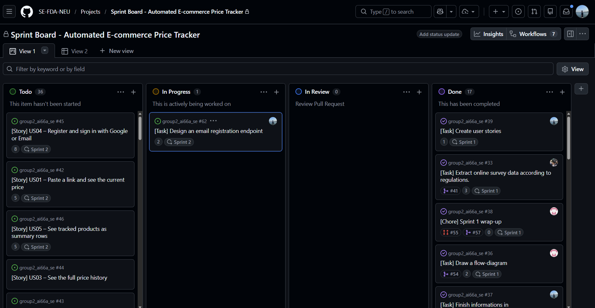
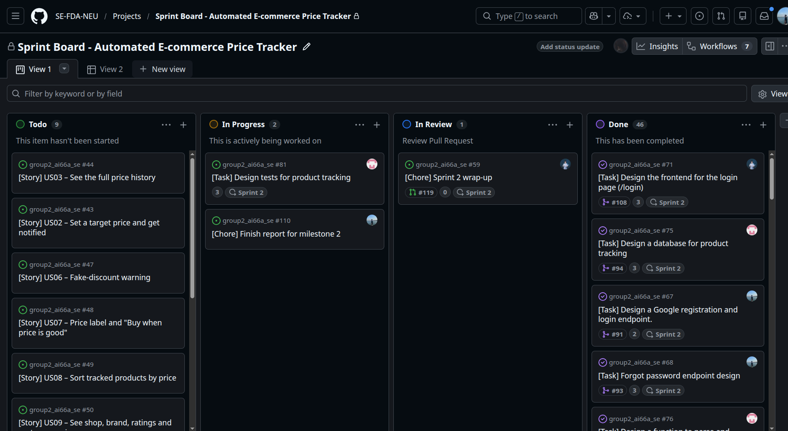
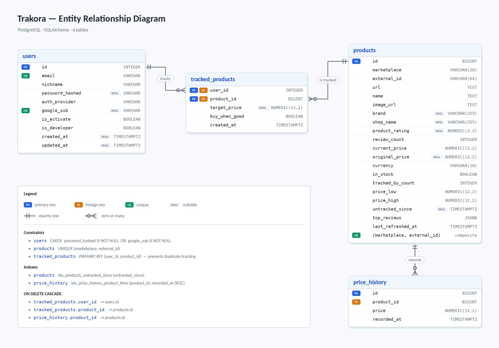
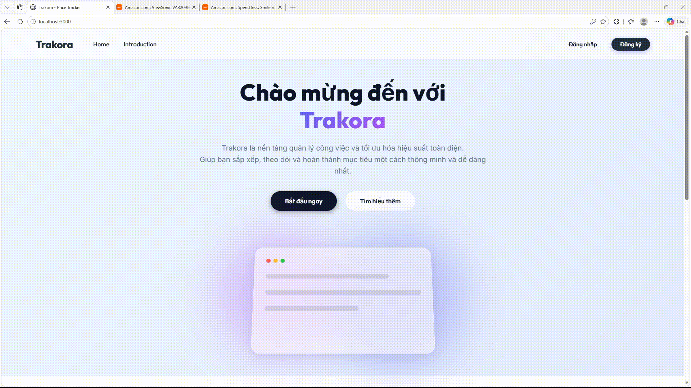

# Milestone 2

```
Team:           Team 02 - Automated E-commerce Price Tracker
Topic:          A3
Members:        Nguyen Trong Dai (11247268), Mai Huy Dang (11247269)
                Pham Huu Gia An (11247254), Mai Tuan Manh (11247318),
                Le Ba Phong (11247339)
Product Owner:  @Dai-nguyen1506
Scrum Master:   @happyhusky3303  (Sprint 2)

Repository:     https://github.com/SE-FDA-NEU/group2_ai66a_se.git;
Project board:  https://github.com/orgs/SE-FDA-NEU/projects/19/views/1;
Pull Request:   ...
Merge commit:   ...

Submitted by:   Nguyen Trong Dai
```





## 1. Architecture

```text
        ┌──────────────────────────────────┐
        │            Web Browser           │
        │       [Container: React SPA]     │
        └────────────────┬─────────────────┘
            HTTP Request │ ^
      (GET/POST /api/v1) │ │ JSON Response
                         v │
        ┌──────────────────────────────────┐
        │          Web Application         │
        │        [Container: FastAPI]      │
        └───────┬─────────┬─────────┬──────┘
      SQL Query │^        │^ Redis  │^ HTTP Request
      (asyncpg) ││Table   ││ Cmd    ││ (httpx)
                ││Data    ││ / Data ││ JSON Resp
                v│        v│        v│
     ┌──────────┴┴─┐  ┌───┴┴───┐ ┌──┴┴────────────┐
     │ PostgreSQL  │  │ Redis 7│ │ RapidAPI Amazon│
     │  [Database] │  │ [Store]│ │   [External]   │
     └─────────────┘  └────────┘ └────────────────┘
```

## 2. Data Model



### Schema Summary & Rules Mapping

| Table | Columns | Constraint · which M1 rule |
|-------|---------|----------------------------|
| **users** | `id` PK · `email` UNIQUE · `nickname` · `password_hashed` NULL · `auth_provider` · `google_sub` UNIQUE NULL · `is_activate` BOOL · `is_developer` BOOL · `created_at` DATE NULL · `updated_at` DATE NULL | CHECK `password_hashed` or `google_sub` required<br>`nickname` NOT NULL, editable in `/profile` · **BR14**<br>OTP not stored here · **BR13** |
| **products** | `id` PK · `marketplace` · `external_id` · `url` · `name` · `image_url` · `brand` NULL · `shop_name` NULL · `product_rating` NULL · `review_count` · `current_price` · `original_price` NULL · `currency` · `in_stock` BOOL · `tracked_by_count` · `price_low` · `price_high` · `untracked_since` DATE NULL · `top_reviews` JSONB · `last_refreshed_at` DATE | UNIQUE (`marketplace`, `external_id`) · **BR3**<br>`marketplace`: shopee/tiktok_shop (amazon=dev only) · **BR9**<br>`price_low` / `price_high`: whole tracked history · **BR6**, **BR7**<br>`untracked_since`: 7-day cleanup · **BR15** |
| **price_history** | `id` PK · `product_id` FK · `price` · `recorded_at` DATE | Append-only, no backfill · **BR3**<br>Distinct days → 7-day rule · **BR5**<br>Source of median/lowest · **BR6**, **BR7**<br>Gap = large interval between rows. CASCADE from `products` · **BR15** |
| **tracked_products**| `user_id` PK FK · `product_id` PK FK · `target_price` NULL · `buy_when_good` BOOL · `created_at` DATE | Composite PK: no duplicate tracking<br>Max 10 tracked products per user · **BR8**<br>Remove → 7-day grace period. CASCADE from `users`, `products` · **BR15** |

### Table: `users`
| Column | Type | Nullable | Default / Constraint | Description |
|--------|------|----------|---------------------|-------------|
| id | Integer | No | PK, indexed | Unique user ID |
| email | String | No | Unique, indexed | Login email |
| nickname | String | No | — | Display name |
| password_hashed | String | Yes | — | Bcrypt hash (null for Google-only) |
| auth_provider | String | No | Default `'email'` | `'email'`, `'google'`, or `'both'` |
| google_sub | String | Yes | Unique, indexed | Google OAuth subject ID |
| is_activate | Boolean | No | Default `true` | Account active flag |
| is_developer | Boolean | No | Default `false` | Admin/developer flag |
| created_at | DateTime(tz) | Yes | `now()` | Creation timestamp |
| updated_at | DateTime(tz) | Yes | on update `now()` | Last update timestamp |

Constraint: `CHECK (password_hashed IS NOT NULL OR google_sub IS NOT NULL)` — every account must have at least one auth method.

### Table: `products`
| Column | Type | Nullable | Default / Constraint | Description |
|--------|------|----------|---------------------|-------------|
| id | BigInteger | No | PK, autoincrement | Product ID |
| marketplace | String(20) | No | — | Platform (e.g. `'amazon'`) |
| external_id | String(64) | No | — | Platform product ID (ASIN) |
| url | Text | No | — | Canonical product URL |
| name | Text | No | — | Product title |
| image_url | Text | No | — | Main photo URL |
| brand | String(255) | Yes | — | Brand/manufacturer |
| shop_name | String(255) | Yes | — | Seller name |
| product_rating | Numeric(3,2) | Yes | — | Star rating (0–5) |
| review_count | Integer | No | Default `0` | Number of ratings |
| current_price | Numeric(12,2) | No | — | Latest price |
| original_price | Numeric(12,2) | Yes | — | Strikethrough price |
| currency | String(10) | No | — | Currency code |
| in_stock | Boolean | No | Default `true` | Availability |
| tracked_by_count | Integer | No | Default `0` | Active tracker count |
| price_low | Numeric(12,2) | No | — | All-time lowest |
| price_high | Numeric(12,2) | No | — | All-time highest |
| untracked_since | DateTime(tz) | Yes | — | When tracker count hit 0 |
| top_reviews | JSONB | No | Default `'[]'::jsonb` | Cached reviews |
| last_refreshed_at | DateTime(tz) | No | Default `now()` | Last API refresh |

Constraints: `UNIQUE(marketplace, external_id)`, Index on `untracked_since` for cleanup.

### Table: `price_history`
Append-only time-series log.
| Column | Type | Nullable | Default / Constraint | Description |
|--------|------|----------|---------------------|-------------|
| id | BigInteger | No | PK, autoincrement | Entry ID |
| product_id | BigInteger | No | FK → products.id CASCADE | Parent product |
| price | Numeric(12,2) | No | — | Price observation |
| recorded_at | DateTime(tz) | No | Default `now()` | Timestamp |

Index: `(product_id, recorded_at DESC)` for efficient time-series queries.

### Table: `tracked_products`
User-to-product watchlist association.
| Column | Type | Nullable | Default / Constraint | Description |
|--------|------|----------|---------------------|-------------|
| user_id | Integer | No | Composite PK, FK → users.id CASCADE | Tracking user |
| product_id | BigInteger | No | Composite PK, FK → products.id CASCADE | Tracked product |
| target_price | Numeric(12,2) | Yes | — | Desired buy price |
| buy_when_good | Boolean | No | Default `false` | Alert on "Good price" label |
| created_at | DateTime(tz) | No | Default `now()` | When tracking started |

Composite PK `(user_id, product_id)` prevents duplicate tracking.

## 3. API Design

### 3.1 Authentication (`/api/v1/auth`)

| # | Method | Path | Auth | Input | Success | Errors |
|---|--------|------|------|-------|---------|--------|
| 1 | POST | `/api/v1/auth/login` | None | Form: `username`, `password` | `200 {access_token, token_type}` | `401 INVALID_LOGIN` |
| 2 | POST | `/api/v1/auth/google` | None | JSON: `{id_token}` | `200 {access_token, token_type}` | `401 GOOGLE_AUTH_FAILED`, `401 INVALID_LOGIN` |
| 3 | POST | `/api/v1/auth/register` | None | JSON: `{email, nickname, password, verify_token}` | `201 ApiResponse<UserResponse>` | `400 OTP_EXPIRED`, `400 EMAIL_ALREADY_EXISTS` |
| 4 | POST | `/api/v1/auth/reset-password` | None | JSON: `{email, new_password, verify_token}` | `200 ApiResponse<null>` | `400 OTP_EXPIRED`, `404 USER_NOT_FOUND` |

### 3.2 OTP (`/api/v1/otp`)

| # | Method | Path | Auth | Input | Success | Errors |
|---|--------|------|------|-------|---------|--------|
| 5 | POST | `/api/v1/otp/send` | None | JSON: `{email, reason?}` | `200 ApiResponse<null>` | `400 EMAIL_ALREADY_EXISTS`, `404 USER_NOT_FOUND`, `500 EMAIL_SEND_FAILED` |
| 6 | POST | `/api/v1/otp/verify` | None | JSON: `{email, otp, reason?}` | `200 ApiResponse<{verified_token}>` | `400 OTP_EXPIRED`, `400 OTP_INVALID`, `400 OTP_LIMIT_EXCEEDED` |

### 3.3 User Profile (`/api/v1/user`)

| # | Method | Path | Auth | Input | Success | Errors |
|---|--------|------|------|-------|---------|--------|
| 7 | GET | `/api/v1/user/me` | Bearer | — | `200 ApiResponse<UserResponse>` | `401 UNAUTHORIZED` |
| 8 | PATCH | `/api/v1/user/me` | Bearer | JSON: `{nickname}` | `200 ApiResponse<UserResponse>` | `401 UNAUTHORIZED` |
| 9 | PATCH | `/api/v1/user/me/password` | Bearer | JSON: `{old_password, new_password}` | `200 ApiResponse<UserResponse>` | `400 INVALID_OLD_PASSWORD`, `401 UNAUTHORIZED` |

### 3.4 Watchlist (`/api/v1/watchlist`)

| # | Method | Path | Auth | Input | Success | Errors |
|---|--------|------|------|-------|---------|--------|
| 10 | POST | `/api/v1/watchlist` | Bearer | JSON: `{url, target_price?, buy_when_good?}` | `201 ApiResponse<Product>` | `400 AMAZON_ONLY`, `400 INVALID_PRODUCT_LINK`, `400 WATCHLIST_LIMIT_REACHED`, `404 USER_NOT_FOUND`, `502 MARKETPLACE_PRODUCT_MISMATCH`, `502 MARKETPLACE_UPSTREAM_ERROR`, `503 MARKETPLACE_UNAVAILABLE` |
| 11 | GET | `/api/v1/watchlist` | Bearer | — | `200 ApiResponse<ProductList>` | `401 UNAUTHORIZED` |
| 12 | DELETE | `/api/v1/watchlist/{product_id}` | Bearer | Path: `product_id` | `204 No Content` | `404 TRACKING_NOT_FOUND` |

### 3.5 Developer (`/api/v1/dev`)

| # | Method | Path | Auth | Input | Success | Errors |
|---|--------|------|------|-------|---------|--------|
| 13 | GET | `/api/v1/dev/system-info` | Bearer+Dev | — | `200 ApiResponse<SystemInfoData>` | `403 NOT_DEVELOPER` |
| 14 | GET | `/api/v1/dev/health` | Bearer+Dev | — | `200 ApiResponse<null>` | `503 DATABASE_ERROR`, `503 REDIS_ERROR` |
| 15 | PATCH | `/api/v1/dev/set-admin` | Bearer+Dev | JSON: `{email}` | `200 ApiResponse<null>` | `503 USER_NOT_FOUND` |

## 4. Walking Skeleton

**Route:** `GET /api/v1/watchlist` · **Table:** `products`, `tracked_products`, `price_history` (Seeded > 10 rows automatically via RapidAPI fetches)

**From `docs/SETUP.md` — the commands section:**

```bash
git clone https://github.com/SE-FDA-NEU/group2_ai66a_se.git
cd group2_ai66a_se
cp .env.example .env
# Edit .env to add your keys (ADMIN_EMAIL, RAPIDAPI_KEY, etc.)
docker compose up -d --build
```

**How to know it worked:** `http://localhost:3000/watchlist` shows a table of products tracked by the user.

**Troubleshooting (excerpt):** 
`MARKETPLACE_UNAVAILABLE` → Missing RapidAPI key in `.env`.
`Connection refused` on backend → Wait 30s for PostgreSQL to finish initializing and restart backend.

**Tested by:** @dainguyen1506 (Team 2) on a fresh Linux machine, 05 Oct — 5 minutes.

**The query behind the page (in `tracked_product_crud.py`):**

```sql
SELECT products.*, tracked_products.target_price, tracked_products.buy_when_good,
       COALESCE(stats.distinct_days, 0) AS distinct_days,
       stats.median_price
FROM tracked_products
JOIN products ON products.id = tracked_products.product_id
LEFT OUTER JOIN (
    SELECT product_id,
           COUNT(DISTINCT CAST(recorded_at AS DATE)) AS distinct_days,
           PERCENTILE_CONT(0.5) WITHIN GROUP (ORDER BY price) AS median_price
    FROM price_history
    GROUP BY product_id
) AS stats ON stats.product_id = products.id
WHERE tracked_products.user_id = :user_id
ORDER BY products.id
```

### 4.1 End-to-end trace

1. **Browser**: User navigates to the watchlist page. React sends `GET /api/v1/watchlist` with `Authorization: Bearer <JWT>` header via Axios.
2. **Vite Proxy**: Dev server proxies `/api/*` requests to `http://backend:8000`.
3. **FastAPI Router** (`watchlist_router.py`): The `list_watchlist` endpoint receives the request.
4. **Dependency Injection** (`deps.py`): `get_current_user` extracts and validates JWT, queries `users` table to get the authenticated user. `get_db` provides an async SQLAlchemy session from the connection pool.
5. **Service Layer** (`watchlist_service.py`): `watchlist_service.list_products(db, user)` is called.
6. **CRUD/Database** (`tracked_product_crud.py`): Executes a JOIN query across `tracked_products`, `products`, and `price_history` tables with PostgreSQL aggregate functions:

```sql
SELECT products.*, tracked_products.target_price, tracked_products.buy_when_good,
       COALESCE(stats.distinct_days, 0) AS distinct_days,
       stats.median_price
FROM tracked_products
JOIN products ON products.id = tracked_products.product_id
LEFT OUTER JOIN (
    SELECT product_id,
           COUNT(DISTINCT CAST(recorded_at AS DATE)) AS distinct_days,
           PERCENTILE_CONT(0.5) WITHIN GROUP (ORDER BY price) AS median_price
    FROM price_history
    GROUP BY product_id
) AS stats ON stats.product_id = products.id
WHERE tracked_products.user_id = :user_id
ORDER BY products.id
```

7. **Business Logic**: The service computes price labels:
   - If `distinct_days < 7`: label = "Not enough data to assess"
   - If `current_price ≤ price_low × 1.05`: label = "Good price"
   - If `current_price > median_price × 1.10`: label = "Expensive - wait"
   - Otherwise: label = "Normal"
   - Fake discount detection: if marketplace claims discount but `current_price > median × 1.10`
8. **Response**: Serialized to `ApiResponse<ProductList>` JSON with HTTP 200, streamed back through Uvicorn → Vite proxy → Browser.

### 4.2 Proof



## 5. Design Decisions (ADR)

### ADR-1: PostgreSQL over SQLite for the application database

| Aspect | Detail |
|--------|--------|
| **Context** | The application needs a relational database that supports concurrent async access, advanced aggregate functions (like `PERCENTILE_CONT` for median price calculation), and JSONB for storing structured review data. |
| **Options considered** | (A) SQLite — zero-config, file-based, good for prototyping. (B) PostgreSQL — full-featured RDBMS with advanced types and concurrency. |
| **Decision** | PostgreSQL 15 |
| **Rationale** | SQLite does not support `PERCENTILE_CONT`, has limited concurrent write support (problematic with async FastAPI), and lacks JSONB. PostgreSQL natively supports all of these. Docker Compose makes deployment trivial. |
| **What would change this** | If the project needed to run as a single-file desktop app without Docker, SQLite would be reconsidered. |

### ADR-2: FastAPI over Django for the backend framework

| Aspect | Detail |
|--------|--------|
| **Context** | The backend needs to serve a REST API with async database access (asyncpg), integrate with external APIs using async HTTP, and handle real-time OTP flows through Redis. |
| **Options considered** | (A) Django + DRF — mature ecosystem, built-in ORM and admin. (B) FastAPI — async-first, Pydantic validation, automatic OpenAPI docs. |
| **Decision** | FastAPI |
| **Rationale** | FastAPI's native async support allows non-blocking database queries (asyncpg), Redis operations, and external API calls (httpx). Django's ORM is sync-first and would require workarounds. Pydantic v2 integration provides request/response validation with zero boilerplate. |
| **What would change this** | If the project needed a built-in admin panel or content management out of the box, Django's batteries-included approach would be more productive. |

### ADR-3: React over Vue or plain HTML/JS for the frontend

| Aspect | Detail |
|--------|--------|
| **Context** | The team needs a robust frontend framework to handle the interactive watchlist and dynamic price charts. |
| **Options considered** | (A) React (with Vite) — component-based, large ecosystem. (B) Vue 3 — progressive, easy to integrate. (C) Plain HTML/JS — zero overhead, no build step. |
| **Decision** | React (with Vite) |
| **Rationale** | React's component-based architecture and large community ecosystem (like React Router and Axios) make development faster and more maintainable than plain HTML/JS. The team also has more prior experience with React than Vue 3. |
| **What would change this** | If the frontend only consisted of static pages with minimal interactivity, we would use plain HTML/JS to avoid the overhead of a framework. |

### ADR-4: Redis over PostgreSQL for OTP management

| Aspect | Detail |
|--------|--------|
| **Context** | The system needs to store temporary OTP codes with expiration times (TTL) and enforce rate limiting (max 5 attempts) across multiple worker processes. |
| **Options considered** | (A) PostgreSQL table — requires manual cleanup jobs. (B) In-memory Python dict — doesn't scale across multiple Uvicorn workers. (C) Redis — native TTL and atomic operations. |
| **Decision** | Redis 7 |
| **Rationale** | Using a PostgreSQL table would require manual cleanup jobs for expired codes and increase database load for simple key-value lookups. An in-memory dict wouldn't work well if the backend scales to multiple worker processes. Redis natively supports TTL and atomic operations, making it perfect for OTPs. |
| **What would change this** | If the hosting budget was strictly limited to a single database container and we couldn't afford to run Redis, we would fall back to storing OTPs in a PostgreSQL table with an `expires_at` column. |

## 6. What Changed Since Milestone 1

### Change 1: Authentication scope expanded from Google-only to multi-provider (US04)

| Aspect | Detail |
|--------|--------|
| **M1 design** | Only "Sign in with Google" was planned. No email registration, no OTP, no password reset. |
| **Current design** | Full email registration with OTP verification (6-digit code, 5-min TTL, max 5 attempts), email/password login, Google OAuth login, and account linking (`auth_provider` can be `'email'`, `'google'`, or `'both'`). Password reset via OTP flow added. |
| **Reason** | Sprint 1 feedback: relying solely on Google excludes users who prefer email accounts. Also needed for the course requirement of demonstrating a complete auth walking skeleton. |
| **Impact** | `users` table gained `auth_provider`, `google_sub`, `nickname` columns. `password_hashed` changed from NOT NULL to nullable. 2 new API groups added (`/otp`, `/auth/register`, `/auth/reset-password`). Redis introduced for OTP session management. US04 story points increased from 3 → 8. |

### Change 2: Nickname added to user profile (US04, BR14)

| Aspect | Detail |
|--------|--------|
| **M1 design** | No concept of user nickname. |
| **Current design** | Google login automatically fetches the nickname. Email registration asks for it. Nickname can be updated later in the profile page. |
| **Reason** | Necessary for personalizing the user experience and displaying a friendly name on the UI instead of an email address. |
| **Impact** | Added `nickname` column to `users` table. Added `/api/v1/user/me` endpoint to edit profile. |

### Change 3: Stricter enforcement of 10-product limit (BR8, US05)

| Aspect | Detail |
|--------|--------|
| **M1 design** | Users are blocked *after* attempting to add the 11th product. |
| **Current design** | Blocked immediately on tapping the "+" button if 10 products are already tracked. The form does not open. |
| **Reason** | Better user experience by preventing users from wasting time pasting a link when they can't add it anyway. |
| **Impact** | Validation moved to a pre-check before opening the UI modal. |

### Change 4: Marketplace support changed from Shopee/TikTok Shop to Amazon (BR9)

| Aspect | Detail |
|--------|--------|
| **M1 design** | Primary marketplaces were Shopee and TikTok Shop. Amazon was explicitly rejected (BR9). |
| **Current design** | Amazon is used as the primary marketplace for Sprint 2 development and testing, via RapidAPI Real-Time Amazon Data API. Shopee/TikTok Shop adapters are deferred to Sprint 3+. |
| **Reason** | No reliable public API exists for Shopee/TikTok Shop product data (scraping violates ToS and is unstable). RapidAPI provides a clean REST endpoint for Amazon with structured JSON responses, enabling the team to build and test the full price-tracking pipeline end-to-end without scraping concerns. |
| **Impact** | `amazon_link_parser.py` replaces the planned Shopee parser. `rapidapi_client.py` added as the marketplace adapter. BR9 updated with a dev/test note. `products.marketplace` stores `'amazon'` instead of `'shopee'`. The adapter interface remains the same (`ProductMarketplace` schema), so Shopee/TikTok adapters can be plugged in later. |

### Change 5: OTP verification for security (BR13)

| Aspect | Detail |
|--------|--------|
| **M1 design** | OTP was not included in the scope. |
| **Current design** | 6-digit OTP code, expires in 5 minutes, maximum 5 failed attempts before a new code is required. |
| **Reason** | Required to verify email ownership during registration and to securely reset passwords. |
| **Impact** | Redis introduced for OTP session management and rate limiting. New endpoints `/api/v1/otp/send` and `/api/v1/otp/verify`. |

### Change 6: Price history metrics replace mini charts (US03, US05-07)

| Aspect | Detail |
|--------|--------|
| **M1 design** | Watchlist rows display a mini "price chart" showing the last "30-day" history. |
| **Current design** | Displays "current price", "lowest price", and "highest price". The timeframe evaluates the "full price history" instead of just 30 days. |
| **Reason** | Text-based metrics (low/high) are more actionable at a glance than a mini chart. Using full history provides better context for "Good price" labels. |
| **Impact** | Backend logic changed to calculate min/max over the entire `price_history` dataset instead of truncating at 30 days. |

### Change 7: 7-day retention grace period for untracked products (BR15)

| Aspect | Detail |
|--------|--------|
| **M1 design** | Not explicitly defined what happens when trackers drop to 0. |
| **Current design** | Products with 0 trackers are kept for a 7-day grace period. Tracking resumes if added again within 7 days. Permanently deleted after 7 days. |
| **Reason** | Saves database space by removing dead products, while preventing accidental data loss if a user immediately re-tracks a product. |
| **Impact** | Added `untracked_since` column to `products` table and a background cleanup mechanism. |
