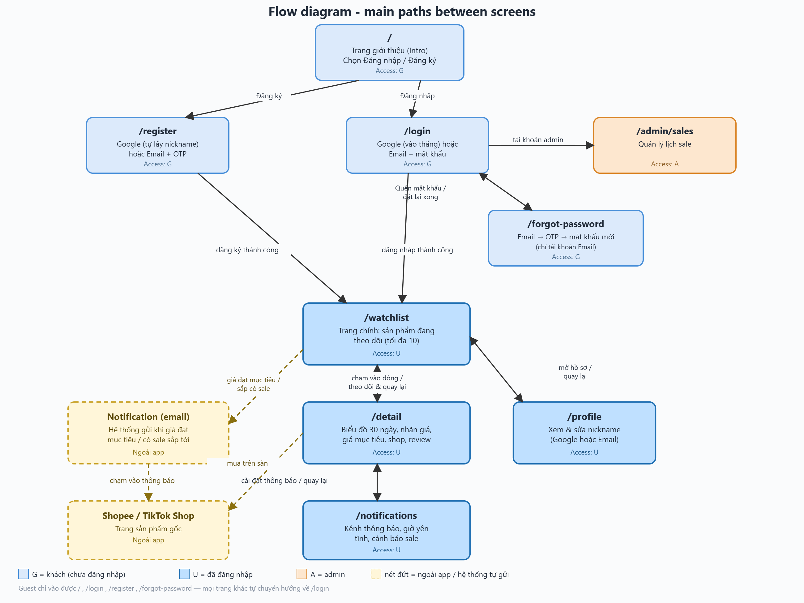

# Milestone 1 - Requirements Document

```
Team:           Team 02 - Automated E-commerce Price Tracker
Topic:          A3
Members:        Nguyen Trong Dai (11247268), Mai Huy Dang (11247269)
                Pham Huu Gia An (11247254), Mai Tuan Manh (11247318),
                Le Ba Phong (11247339)
Product Owner:  @Dai-nguyen1506
Scrum Master:   @happyhusky3303  (Sprint 2)

Repository:     https://github.com/SE-FDA-NEU/group2_ai66a_se.git;
Project board:  https://github.com/orgs/SE-FDA-NEU/projects/19/views/1;
Pull Request:   https://github.com/SE-FDA-NEU/group2_ai66a_se/pull/56
Merge commit:   4e720f6decdec7a4cd3393a0fa5eaac5efc06912

Submitted by:   Nguyen Trong Dai
```

## Proof board


---

## 1. Product vision

For students who shop on Shopee and TikTok Shop and want to buy at the right moment without watching prices by hand, Automated E-commerce Price Tracker is a web app, built to work well on a phone screen. It keeps the real price history of each product, checks how trustworthy a shop is, flags fake discounts and alerts the user as soon as a price reaches the level they want. Unlike watching prices yourself or trusting a marketplace's "big discount" tag, it shows which price is genuinely good and when to buy.

## 2. Personas

### Persona 1 – Trang, 19, second-year student

- **Role:** Second-year student living in rented accommodation, supported by her family and a part-time job. Shops online mainly on Shopee and TikTok Shop and hunts for sales constantly: adds products to the cart, looks for vouchers and waits for sale days and time slots.
- **Goal:** Buy an item at the lowest possible price and save money without spending much time watching prices herself. Wants to be notified when a product drops in price or a suitable sale starts, so she knows when to buy.
- **Blocked by:** Has to check and watch prices manually; sees the price fall further right after she buys; easily misses a flash sale if she is not online at the right time; cannot tell a real discount from a fake one.
- **In her words:** "Theo dõi giá cho tao rồi báo cho tao chấm hết"
- **Technical skill:** Phone only, average comfort with technology.
- **Interview note:** Synthesised from 3 students (T. Trang, Ha, Trang) in 3 face-to-face interviews on 15 Sep 2026, 18 Sep 2026 and [date]. Trang's personal details are a composite of these 3 people.

### Persona 2 – Ha, 19, second-year student

- **Role:** Second-year student living in a dormitory, receives 5–10 million VND per month from her family. Shops online on Shopee and TikTok Shop (under 5 million VND per month) but does not hunt sales all the time: she only watches prices when she needs something or on special occasions, then compares across several marketplaces. Opens an app to check prices only when she is free in her room or during breaks.
- **Goal:** Place the order at exactly the moment the price is best, to save as much as possible, without sitting and watching prices by hand.
- **Blocked by:** Cannot tell whether the price has hit its lowest point (one or a few days after buying, the price drops further); if she is slow the item sells out or the flash sale ends; cannot trust marketplace information (suspects prices are raised first and then tagged with a big discount, and goods arrive different from the photos even after careful comparison).
- **In her words:** "Thỉnh thoảng mình có để ý thấy tình trạng nâng giá lên rồi gắn mác giảm giá sâu…"
- **Technical skill:** Mainly phone, average comfort with technology.
- **Interview note:** Synthesised from 2 students (H, Quỳnh) in 2 face-to-face interviews on 16 Sep 2026 and 18 Sep 2026. Ha's personal details are a composite of these 2 people.

### Persona 3 – Van, 20, third-year student

- **Role:** Third-year student supported by her family and part-time work. Shops online mainly on Shopee and TikTok Shop, under 1 million VND per month. Does not hunt sales on a fixed schedule; usually opens an app to check prices when she suddenly wants something.
- **Goal:** Buy a good-quality item from a reputable shop at the lowest price, and spend less time searching and watching prices.
- **Blocked by:** Only finds out after buying that a better option existed; cannot trust marketplace information (ends up with counterfeit or poor goods); hunts sales too late or ineffectively.
- **In her words:** "Trước mình có mua một nồi chiên không dầu 4.5 lít gần 700k xong thì em họ của mình check trên máy điện thoại ở Shopee cùng một shop thì kết quả là có một nồi chiên không dầu khác 5.5 lít giá cũng 700k."
- **Technical skill:** Phone only.
- **Interview note:** Interviewed online and face to face (Van, Anh), third-year students, on 16 Sep 2026.

## 3. Scenarios

### Scenario 1 – Trang waits for a good price on a pair of earbuds

1. Trang sees a Bluetooth earbud set on Shopee selling for 350,000đ. She wants it but does not know whether the price is good.
2. She opens the app, signs in with her Google account, then copies the product link and pastes it into the app.
3. The app shows the product name, the current price and how the price moved over the last 20 days. The data is already there because other students were tracking the same product.
4. She sees the usual price is around 320,000đ, so 350,000đ is not attractive and she decides to wait.
5. She asks the app to alert her when the price is rated a "good price", instead of picking a number herself.
6. She closes the app and goes back to studying, without opening Shopee to check the price.
7. Four days later her phone alerts her that the earbuds dropped to 289,000đ, the lowest in 20 days, with a link to the product.
8. Trang opens the alert, looks at the price movement once more to be sure, then goes to Shopee and buys.

### Scenario 2 – Ha buys a makeup remover at its lowest price

1. At 9 p.m. on Monday, Ha is in her dormitory room and her bottle of Cocoon makeup remover is almost empty. Shopee shows "40% off" at 239,000đ.
2. She does not want to repeat the experience of buying and finding the price even lower the next day, so she opens the app, signs in with her Google account, then copies the product link and pastes it into the app.
3. The app shows 30 days of price history (many other students have tracked this product before): the usual price is about 195,000đ; 3 days ago it was raised to 399,000đ and only then "cut 40%" to 239,000đ.
4. The app warns her that this is a fake discount because 239,000đ is still above the usual price.
5. Ha decides to wait, sets her desired price at 195,000đ and turns on notifications, which takes only a few taps.
6. She closes the app and goes back to what she was doing, without having to come back and watch the price.
7. At 4:07 p.m. on Wednesday, during a break between classes, her phone alerts her that the price dropped to 189,000đ, below her target, with a link to the product.
8. Ha opens the alert, goes straight to that product on Shopee and places the order during her break.

### Scenario 3 – Van picks the right shop and buys a night lamp at its lowest price

1. On Monday Van wants a new night lamp. She finds 4 shops on Shopee selling it for between 50,000đ and 100,000đ and cannot decide which to buy from.
2. She opens the app, signs in with her Google account, then copies the 4 product links and adds them to the app one by one.
3. The app shows the 4 products together, each with its current price, lowest and highest price, star rating and a trust label for its shop. Three products already have price history from other students; the fourth is new, so the app shows only today's price.
4. Van orders the products from the cheapest to the most expensive and notices that one shop is marked as risky because it has very few reviews.
5. She opens the product of the most trusted shop to read about the shop and the customer reviews, and decides to buy from it.
6. She stops tracking the other 3 products, sets her desired price for the chosen one at 60,000đ, turns on notifications and goes back to her own things.
7. On Friday the app warns her that a big Shopee sale starts on Sunday, and that the lamp's price has already dropped to 70,000đ.
8. At 2 a.m. on Sunday the price hits its floor of 40,000đ and her phone alerts her immediately.
9. Van opens the alert and buys straight away, and does not fall asleep and miss the sale as she did so many times before.

## 4. User stories

| ID   | Story                                                                                                                                                                                               | Priority | Points |
| ---- | --------------------------------------------------------------------------------------------------------------------------------------------------------------------------------------------------- | -------- | ------ |
| US01 | As Ha, I want to paste a Shopee or TikTok Shop product link and see its current price right away so that I can start tracking it without checking prices myself                                     | P0       | 5      |
| US02 | As Ha, I want to set a target price and be notified when the price reaches it so that I buy at the right moment without watching the price                                                          | P0       | 8      |
| US03 | As Ha, I want to see a price-history chart covering however long the product has been tracked so that I know whether the current price is high or low compared with usual                            | P0       | 5      |
| US04 | As Trang, I want to register and sign in with Google or Email (with a nickname, OTP verification and password recovery) so that my tracked products and target prices are saved                            | P0       | 8      |
| US05 | As Trang, I want to see all my tracked products on one page, each as a row with its current price, lowest price, highest price, name, star rating and labels, so that I can see at a glance which product is close to a good price | P0       | 5      |
| US06 | As Ha, I want to be warned when a "discount" is actually above the usual price so that I am not fooled by a price that was raised and then cut                                                      | P1       | 5      |
| US07 | As Trang, I want to see a Good price / Normal / Expensive label and choose "Buy when price is good" so that I do not have to invent a target price myself                                           | P1       | 5      |
| US08 | As Van, I want to sort my tracked products by current price so that I can compare shops selling the same item at a glance and pick the best one                                                     | P1       | 3      |
| US09 | As Van, I want to see a product's shop, brand, ratings and customer reviews so that I avoid counterfeit or poor-quality goods                                                                       | P1       | 5      |
| US10 | As Van, I want to receive notifications via email and set quiet hours so that I still get alerts when my browser does not support push and I am not disturbed while sleeping                        | P1       | 3      |
| US11 | As Van, I want to be warned before big sales so that I do not miss a flash sale                                                                                                                     | P2       | 3      |
| US12 | As Admin, I want to manage the sale calendar so that the app warns users about upcoming sales accurately                                                                                            | P2       | 3      |

### Acceptance criteria and Tasks

#### US01 – Paste a link and see the current price · P0 · 5 points · Screens: /watchlist, /detail

As Ha, I want to paste a Shopee or TikTok Shop product link and see its current price right away so that I can start tracking it without checking prices myself.

Acceptance criteria:

- Given the product is not in the database, when I paste a valid Shopee link, then the system calls the marketplace API once, saves the product with its first price, and /detail shows the product name and current price within 5 seconds (BR3).
- Given the product is already in the database and at least 1 other user is tracking it, when I paste its link, then the system returns the data from the database without calling the API and /detail shows it within 2 seconds (BR3).
- Given the product is already in the database but nobody is currently tracking it (it is within its 7-day grace period, BR15), when I paste its link, then the system calls the marketplace API once more to refresh the price before showing /detail, and tracking resumes.
- Given I paste an amazon.com link, when I submit it, then the message "Only Shopee and TikTok Shop links are supported" is shown (BR9).
- Given I paste text containing 2 product links, when I submit it, then the message "Paste one product link at a time" is shown (BR9).
- Given I already track 10 products, when I tap the "+" button, then the form to paste a link never opens, and I instead see "You have reached the limit of 10 tracked products" (BR8).

Tasks:

- "+" button and link input on /watchlist, with validation (Shopee, TikTok Shop, short links) - @Dai-Nguyen1506
- Database lookup; API call and save the first price when the product is missing; immediate re-fetch when the product exists but is currently untracked (BR3, BR15) - @huydang2006

#### US02 – Set a target price and get notified · P0 · 8 points · Screen: /detail

As Ha, I want to set a target price for a tracked product and be notified when the price drops to it so that I buy at the right moment without watching the price.

Acceptance criteria:

- Given I am tracking a product priced 239,000đ, when I set a target price of 195,000đ, then the target is saved and the product shows "Alert at 195,000đ".
- Given the target is 195,000đ, when the price drops to 189,000đ, then I receive a notification within 6 minutes with the product name, the new price 189,000đ and a link to the product; tapping it opens the product page on Shopee (BR4).
- Given the current price is 239,000đ, when I set a target of 250,000đ, then it is rejected with "Target must be lower than the current price 239,000đ" (BR1).
- Given I was notified at 189,000đ, when the price changes to 190,000đ (still below 195,000đ), then I am not notified again (BR2).
- Given I was notified at 189,000đ, when the price rises to 196,000đ, then I receive "Price is now above your target of 195,000đ" within 6 minutes; if it later drops to 192,000đ I am notified again that the target is reached (BR2).

Tasks:

- Target price form and BR1 validation - @happyhusky3303
- Job that refreshes prices every 5 minutes and sends notifications (BR2, BR4); the same job also permanently deletes any product whose 7-day grace period has expired with nobody tracking it (BR15) - @maimanhbel
- Link that opens the product page on the marketplace - @Dai-Nguyen1506

#### US03 – See the full price history · P0 · 5 points · Screen: /detail

As Ha, I want to see a price-history chart covering however long the product has been tracked so that I know whether the current price is high or low compared with usual.

Acceptance criteria:

- Given a product has been tracked continuously with a lowest price of 189,000đ and a highest price of 399,000đ, when I open /detail, then the chart shows the full tracked period and marks both 189,000đ and 399,000đ.
- Given a product was first tracked 3 days ago, when I open /detail, then the chart shows only those 3 days and the note "Only 3 days of data so far" (BR3, BR5).
- Given a product was untracked by everyone for a period and then tracked again (BR15), when I open /detail, then the chart shows the earlier points and the newer points with a visibly shaded/dashed gap in between for the untracked period, instead of connecting them with a straight line.
- Given I tap a point on the chart, when the point is in a tracked period, then its price and time are shown, for example "239,000đ – 18/09 14:00"; when I tap inside a shaded gap, then it shows "No data recorded during this period" instead of a price.
- Given a phone screen 375px wide, when I open /detail, then the page has no horizontal scrolling.

Tasks:

- Store one price record every time a price is refreshed - @huydang2006
- API that returns the full price history for a product, flagging any gap where the interval between two consecutive records is much larger than the normal 5-minute refresh cadence (BR15) - @CaMapCon26
- Price chart that works on a phone screen, rendering flagged gaps as a shaded/dashed region instead of a straight line - @happyhusky3303

#### US04 – Register and sign in with Google or Email · P0 · 8 points · Screens: /register, /login, /forgot-password

As Trang, I want to register and sign in with Google or Email so that my tracked products and target prices are saved.

Acceptance criteria — Register:

- Given I choose to register with Google, when I grant permission, then my nickname is taken automatically from my Google profile, my account is created, and I land on `/watchlist` (no extra field to fill in).
- Given I choose to register with Email, when I open the register form, then I am asked for nickname, email, password and confirm password.
- Given I fill in the Email register form, when password and confirm password do not match, then the message "Passwords do not match" is shown and the form is not submitted.
- Given I submit a valid Email register form, when it is accepted, then a 6-digit OTP is sent to my email and I am prompted to enter it within 5 minutes (BR13).
- Given I am on the OTP verification step, when I enter a valid, unexpired OTP, then my account is verified, my session is saved, and I land on `/watchlist`.
- Given I am on the OTP verification step, when I enter an incorrect OTP, then an error is shown and I may try again, up to 5 attempts (BR13).
- Given I have used all 5 attempts or the 5-minute window has passed, when I try again, then I am told the code has expired and offered a new OTP.

Acceptance criteria — Sign in:

- Given I am not signed in, when I choose Google sign-in and grant permission, then I land on `/watchlist` within 3 seconds, with no extra form.
- Given I am not signed in, when I choose Email sign-in, then I am asked for email and password only (no OTP at this step).
- Given I am not signed in, when I open `/watchlist`, `/detail`, `/notifications` or `/admin/sales` directly, then I am redirected to `/login`.
- Given I am not signed in, when I open `/`, then the sign-in options (Google and Email) are shown and there is no box for pasting a link.
- Given I am signed in (including when reopening the browser), when I open `/`, then I am automatically redirected to `/watchlist` without having to log in again.

Acceptance criteria — Forgot password:

- Given I am on `/login` and tap "Forgot password", when I enter my email, then a 6-digit OTP is sent to that email (BR13).
- Given I enter a valid, unexpired OTP, when I submit it, then I am asked to enter and confirm a new password, and can then sign in with it.
- Given the OTP is wrong or expired, when I submit it, then an error is shown and I am offered a new OTP, following the same 5-attempt/5-minute rule as registration (BR13).
- Given I registered with Google only, when I try "Forgot password", then this option is not offered, since Google accounts have no app password to reset.

Acceptance criteria — Nickname:

- Given my account was created via Google, when I open my profile, then my nickname shows the one taken from Google, and I can edit and save a new one (BR14).
- Given my account was created via Email, when I open my profile, then I can edit and save my nickname at any time (BR14).

Tasks:

- Google Sign-In and Email register/sign-in forms - @maimanhbel
- OTP generation, delivery, expiry and attempt-limit logic (BR13) - @huydang2006
- /login, /register, /forgot-password pages and a landing page with the sign-in options only - @Dai-Nguyen1506
- Profile screen with editable nickname (BR14) - @CaMapCon26
- Block signed-in-only pages for guests - @huydang2006

#### US05 – See tracked products as summary rows · P0 · 5 points · Screen: /watchlist

As Trang, I want to see all my tracked products on one page, each as a row with its current price, lowest price, highest price, name, star rating and labels, so that I can see at a glance which product is close to a good price.

Acceptance criteria:

- Given I track 5 products, when I open /watchlist, then I see 5 rows, each with product name, current price, lowest price and highest price recorded over the tracked period, star rating and labels, and the page loads within 2 seconds.
- Given a product has price records spanning 5 distinct days, when I open /watchlist, then its price label reads "Not enough data to assess" (BR5).
- Given I already track 10 products, when I tap the "+" button, then the form to paste a link never opens, and I instead see "You have reached the limit of 10 tracked products" (BR8).
- Given a tracked product, when I remove it, then its row disappears immediately and I receive no more notifications about it; the product's data is kept for 7 more days in case I or someone else tracks it again (BR15).
- Given a row on /watchlist, when I tap it, then /detail opens for that same product.
- Given a phone screen 375px wide and 5 tracked products, when I open /watchlist, then all 5 rows are shown without horizontal scrolling.

Tasks:

- Product row with name, current price, lowest and highest price, stars and labels - @CaMapCon26
- API to list tracked products (with BR8 check on add) and to remove a tracked product, which decrements the tracker count and starts its 7-day grace period without touching its stored history (BR15) - @happyhusky3303
- Responsive layout for phone screens - @maimanhbel

#### US06 – Fake-discount warning · P1 · 5 points · Screens: /detail, /watchlist

As Ha, I want to be warned when a "discount" is actually above the usual price so that I am not fooled by a price that was raised and then cut.

Acceptance criteria:

- Given the median price over the product's tracked history is 195,000đ, the price was once raised to 399,000đ and the marketplace now shows "40% off" at 239,000đ, when I open /detail, then it shows "Fake discount: 23% above the usual price" (BR6).
- Given the same product, when I open /watchlist, then its row shows the label "Fake discount" (BR6).
- Given a product has 5 days of data, when I open /detail, then it shows "Not enough data to assess" instead of the warning (BR5).

Tasks:

- Fake-discount detection (median over the product's tracked history × 1.10) - @Dai-Nguyen1506
- Show the warning on /detail and the label on /watchlist rows - @huydang2006

#### US07 – Price label and "Buy when price is good" · P1 · 5 points · Screens: /detail, /watchlist

As Trang, I want to see a Good price / Normal / Expensive label and choose "Buy when price is good" so that I do not have to invent a target price myself.

Acceptance criteria:

- Given the lowest price over the product's tracked history is 189,000đ, when the current price is 195,000đ, then the label "Good price" is shown because 195,000đ ≤ 189,000đ × 1.05 = 198,450đ (BR7).
- Given the median price over the product's tracked history is 195,000đ, when the current price is 239,000đ, then the label "Expensive – wait" is shown because 239,000đ > 195,000đ × 1.10 = 214,500đ; at 205,000đ the label is "Normal" (BR7).
- Given I choose "Buy when price is good" instead of entering a number, when the label changes to "Good price", then I receive 1 notification within 6 minutes and am not notified again (BR2, BR4).
- Given a product has 4 days of data, when I open /detail or /watchlist, then it shows "Not enough data to assess" instead of a price label (BR5).

Tasks:

- Price label logic - @CaMapCon26
- "Buy when price is good" option in the tracking form - @happyhusky3303

#### US08 – Sort tracked products by price · P1 · 3 points · Screen: /watchlist

As Van, I want to sort my tracked products by current price so that I can compare shops selling the same item at a glance and pick the best one.

Acceptance criteria:

- Given I track 3 lamps priced 70,000đ, 40,000đ and 55,000đ, when I sort by price from low to high, then the rows appear in the order 40,000đ, 55,000đ, 70,000đ.
- Given the same 3 lamps, when I sort by price from high to low, then the rows appear in the order 70,000đ, 55,000đ, 40,000đ.
- Given I track 8 products, when I change the sort order, then all 8 rows are reordered within 1 second.

Tasks:

- Sort control on /watchlist - @maimanhbel
- Sort logic by current price (ascending and descending) - @Dai-Nguyen1506

#### US09 – See shop, brand, ratings and customer reviews · P1 · 5 points · Screens: /detail, /watchlist

As Van, I want to see a product's shop, brand, ratings and customer reviews so that I avoid counterfeit or poor-quality goods.

*(Not started yet — the current product-data API only returns the product's own rating, not the shop's rating/review count needed for BR10. Fetching shop-level data is part of building this story.)*

Acceptance criteria:

- Given a product sold by a shop with 4.8★ and 1,200 ratings, when I open /detail, then it shows the shop name, brand, product name and the label "Trusted" (BR10).
- Given a shop with 4.9★ but only 12 ratings, when I open /detail, then it shows the label "Risky: few ratings" (BR10).
- Given a shop with 4.5★ and 800 ratings, when I open /detail, then it shows the label "Needs caution" (BR10).
- Given a product with customer reviews, when I open /detail, then I see the product's average rating, its number of ratings and its 5 most recent customer reviews.
- Given a tracked product from a "Trusted" shop, when I open /watchlist, then its row shows the label "Trusted" (BR10).

Tasks:

- Fetch shop name, brand, ratings and reviews from the marketplace API - @huydang2006
- Shop trust label logic and /detail layout - @CaMapCon26

#### US10 – Notification channels and quiet hours · P1 · 3 points · Screen: /notifications

As Van, I want to receive notifications via email and set quiet hours so that I still get alerts when my browser does not support push and I am not disturbed while sleeping.

Acceptance criteria:

- Given I turn on email and a price reaches my target, when the notification is sent, then an email arrives at my Google address within 6 minutes with the product name, the new price and a link to the product (BR4).
- Given I set quiet hours 23:00–07:00 and a price reaches my target at 02:00, when the system detects it, then the notification is sent at 07:00 (BR11).
- Given I have not set quiet hours and a price reaches my target at 02:00, when the system detects it, then the notification is sent within 6 minutes (BR11).
- Given I am on /detail of a tracked product, when I tap "Notification settings", then /notifications opens; when I then tap "Back", I return to the same product on /detail.

Tasks:

- Notifications permission request - @happyhusky3303
- Email notifications - @maimanhbel
- /notifications page and saving quiet hours - @Dai-Nguyen1506
- Link between /detail and /notifications, including the way back - @huydang2006

#### US11 – Warning before big sales · P2 · 3 points · Screen: /notifications

As Van, I want to be warned before big sales so that I do not miss a flash sale.

Acceptance criteria:

- Given a big sale starts at 00:00 on Sunday and I track at least 1 product, when 00:00 on Friday (48 hours before) arrives, then I receive a notification with the sale name, its start time and the current price of my tracked product (BR12).
- Given I track no products, when the 48-hour mark before a sale arrives, then I receive no notification (BR12).
- Given I turn off "Sale alerts", when a sale is coming, then I receive no sale alert but still receive target-price notifications.

Tasks:

- Job that sends the 48-hour pre-sale notification - @huydang2006
- "Sale alerts" switch on /notifications - @CaMapCon26

#### US12 – Manage the sale calendar · P2 · 3 points · Screen: /admin/sales

As Admin, I want to manage the sale calendar so that the app warns users about upcoming sales accurately.

Acceptance criteria:

- Given my account has the admin role, when I sign in with Google, then I land on /admin/sales within 3 seconds.
- Given I am an admin, when I add the sale "11.11" starting at 00:00 on 11/11, then the sale is saved and appears in the list.
- Given I enter an end date before the start date, when I save, then it is rejected with "End date must be after the start date".
- Given I am a regular user, when I open /admin/sales, then a 403 page is shown with the message "You do not have permission to view this page".

Tasks:

- Page to add, edit and delete sales - @happyhusky3303
- Admin role check - @maimanhbel

## 5. Business rules

| ID   | Rule                                                                                                                                                                                                                                                                                                              | Worked example                                                                                                                                                                                                                                                                                                          |
| ---- | ----------------------------------------------------------------------------------------------------------------------------------------------------------------------------------------------------------------------------------------------------------------------------------------------------------------- | ----------------------------------------------------------------------------------------------------------------------------------------------------------------------------------------------------------------------------------------------------------------------------------------------------------------------- |
| BR1  | A target price must be lower than the product's current price                                                                                                                                                                                                                                                     | Current price 239,000đ: setting 250,000đ → rejected; setting 239,000đ → rejected; setting 195,000đ → saved                                                                                                                                                                                                              |
| BR2  | When the price falls to or below the target, the system notifies once and does not repeat while the price stays at or below the target. When the price rises above the target, it sends one "above target" notice. If the price falls to or below the target again, it notifies again                             | Target 195,000đ. 189,000đ → "target reached" sent. 190,000đ → nothing. 196,000đ → "price is now above your target" sent. 210,000đ → nothing. 192,000đ → "target reached" sent a second time                                                                                                                             |
| BR3  | When a user pastes a link, the system looks for the product in the database first. If found and at least 1 user is already tracking it, it returns the stored data without calling the API. If found but nobody is currently tracking it (within its 7-day grace period, BR15), it calls the API once to refresh the price before returning. If not found at all, it calls the marketplace API, saves the product and starts recording price history from that moment. It never backfills prices from before tracking started | Ha pastes a link for a product already tracked by another user → full history returned, 0 API calls. A student pastes a link to a product nobody has tracked in 3 days (still within its grace period) → 1 API call to refresh the price, tracking resumes, old history is kept. A student pastes a link not yet in the database at all → 1 API call, price saved, history starts from now |
| BR4  | A product tracked by at least 1 user has its price refreshed every 5 minutes; a target-price notification is sent within 1 minute after the system detects the price reached the target (6 minutes at most in total)                                                                                              | Price drops at 16:02 → next refresh at 16:07 at the latest → notification arrives at 16:08 at the latest                                                                                                                                                                                                                |
| BR5  | Price labels and the fake-discount warning are shown only when a product has price records spanning at least 7 distinct calendar days; with less, the app shows "Not enough data to assess". Days with no data (because nobody was tracking the product) do not count toward this total                        | Product tracked on 4 separate days so far → "Not enough data to assess"; once it has been tracked (not necessarily consecutively) on 7 distinct days → price label shown                                                                                                                                               |
| BR6  | A product gets the "Fake discount" label when the marketplace shows a discount but the current price is more than 10% above the median price computed over the product's entire tracked history to date (excluding any untracked gap periods)                                                                   | Median 195,000đ → threshold 195,000 × 1.10 = 214,500đ. Marketplace shows "40% off" at 239,000đ > 214,500đ → labelled (23% above the usual price). Marketplace shows 205,000đ → not labelled                                                                                                                             |
| BR7  | Price label: **Good price** when the current price ≤ the lowest price recorded over the product's tracked history × 1.05; **Expensive** when it is > the median price over the tracked history × 1.10; otherwise **Normal**                                                                                     | Lowest 189,000đ, median 195,000đ → Good price when ≤ 198,450đ, Expensive when > 214,500đ. 195,000đ → Good price; 205,000đ → Normal; 239,000đ → Expensive                                                                                                                                                                |
| BR8  | Each user can track at most 10 products. The "+" button is blocked as soon as the limit is reached — the paste-link form is never shown for an 11th product                                                                                                                                                       | Tracking 10 products, tapping "+" → form does not open, "You have reached the limit of 10 tracked products" is shown                                                                                                                                                                                                    |
| BR9  | Only one Shopee or TikTok Shop product link is accepted per submission (short links included). *(Dev/test note: while Shopee/TikTok API access is not yet available, the same validation temporarily also accepts one Amazon link, for testing purposes only — this is not part of the official product scope.)* | An amazon.com link → rejected (official scope). A shopee.vn link → accepted. Text containing 2 links → rejected                                                                                                                                                                                                         |
| BR10 | Shop trust label: **Trusted** when ≥ 4.7★ and ≥ 500 ratings; **Risky** when < 4.3★ or < 50 ratings; all other cases are **Needs caution**                                                                                                                                                                         | 4.8★ / 1,200 ratings → Trusted. 4.9★ / 12 ratings → Risky. 4.5★ / 800 ratings → Needs caution                                                                                                                                                                                                                           |
| BR11 | Target-price notifications are sent at any hour unless the user sets quiet hours; a notification that occurs during quiet hours is sent when they end                                                                                                                                                             | Price hits the target at 02:00. No quiet hours → sent within 6 minutes. Quiet hours 23:00–07:00 → sent at 07:00                                                                                                                                                                                                         |
| BR12 | A big sale is announced 48 hours in advance, only to users who track at least 1 product                                                                                                                                                                                                                           | Sale starts 00:00 Sunday → notice sent 00:00 Friday. User tracking 0 products → no notice                                                                                                                                                                                                                               |
| BR13 | An OTP (Email registration and forgot-password) is 6 digits, expires after 5 minutes, and allows at most 5 attempts before it must be reissued                                                                                                                                                                    | OTP sent at 21:00 → valid until 21:05. 5 wrong entries before 21:05 → "code expired, request a new one"; correct on the 3rd try before 21:05 → accepted                                                                                                                                                                |
| BR14 | A Google account's nickname defaults to the name from the Google profile; an Email account's nickname is the one entered at registration. Either way, the user can edit their nickname at any time from their profile                                                                                            | User registers with Google as "Trang Nguyen" → nickname "Trang Nguyen"; later edits it to "Trang" → nickname becomes "Trang" everywhere it is shown                                                                                                                                                                     |
| BR15 | When a product's last tracker removes it (tracked-by-count drops to 0), its product record and price history are kept for 7 days in case someone tracks it again. If it is tracked again within that window, tracking resumes using the same record — the price chart shows a shaded/dashed gap for the untracked period instead of interpolating a fake price. If 7 days pass with nobody tracking it, the product and its entire price history are permanently deleted | Last tracker removes a product on 1 Oct → tracked again on 5 Oct: history resumes, chart shows a gap for 1–5 Oct. Nobody tracks it again by 8 Oct → product and its price history are deleted for good |

## 6. Screens and flow

Access: G = guest (not signed in), U = signed-in user, A = admin. A guest can only reach / and /login; every other screen requires sign-in.

| Route            | Purpose                                                                                                                                                                                                                                                                                                                    | Access | Priority |
| ---------------- | --------------------------------------------------------------------------------------------------------------------------------------------------------------------------------------------------------------------------------------------------------------------------------------------------------------------------- | ------ | -------- |
| /                | Introduction Page and Landing page with Google and Email sign-in. A signed-in user is redirected to /watchlist                                                                                                                                                                                                            | G      | P0       |
| /register        | Create an account with Google (nickname taken from Google) or Email (nickname, email, password, confirm password, then OTP verification). Sends users to /watchlist on success                                                                                                                                          | G      | P0       |
| /login           | Sign in with Google (straight through) or Email (email + password). "Forgot password" opens /forgot-password. Sends users to /watchlist and admins to /admin/sales                                                                                                                                                       | G      | P0       |
| /forgot-password | Enter email, receive and verify a 6-digit OTP, then set a new password. Email-account only                                                                                                                                                                                                                                | G      | P0       |
| /watchlist       | Main page. One row per tracked product: product name, current price, lowest price, highest price, star rating and labels (price label, fake discount). Tap the "+" button and paste a link to add a product (blocked once 10 products are tracked, BR8), sort by price, remove a product (kept 7 days for possible resume, BR15). Tapping a row opens /detail | U      | P0       |
| /detail          | Everything about one tracked product: full price chart for as long as it has been tracked, with gaps shown for any untracked period (BR15), lowest and highest price, price label, fake-discount warning, set target price, shop name, brand, product rating and customer reviews, link to the marketplace page, remove tracking, and "Notification settings" which opens /notifications | U      | P0       |
| /notifications   | Notification channel (web push or email), quiet hours, sale alerts on/off. Opened from /detail; "Back" returns to that product                                                                                                                                                                                            | U      | P1       |
| /profile         | Shows the user's nickname (auto-filled from Google, or as entered at Email registration) and lets them edit and save a new nickname                                                                                                                                                                                       | U      | P1       |
| /admin/sales     | Manage the sale calendar                                                                                                                                                                                                                                                                                                   | A      | P2       |

Main path: / → /login (or /register) → /watchlist → /detail → /notifications. A guest who opens /watchlist, /detail, /notifications, /profile or /admin/sales directly is redirected to /login.

How each screen is reached:

| Screen            | Reached from                                          |
| ----------------- | ----------------------------------------------------- |
| /                 | Web Introduction (starting point)                     |
| /register         | / (create account); /login ("Don't have an account?") |
| /login            | / (sign in); /register (already have an account)      |
| /forgot-password  | /login ("Forgot password")                            |
| /watchlist        | /login or /register (signed in); /detail (product tracked or back) |
| /detail           | /watchlist (tap a row); /notifications (back)         |
| /notifications    | /detail (notification settings)                       |
| /profile          | /watchlist (profile menu); anywhere signed-in (back)  |
| /admin/sales      | /login (admin account)                                |

**Flow diagram:**

