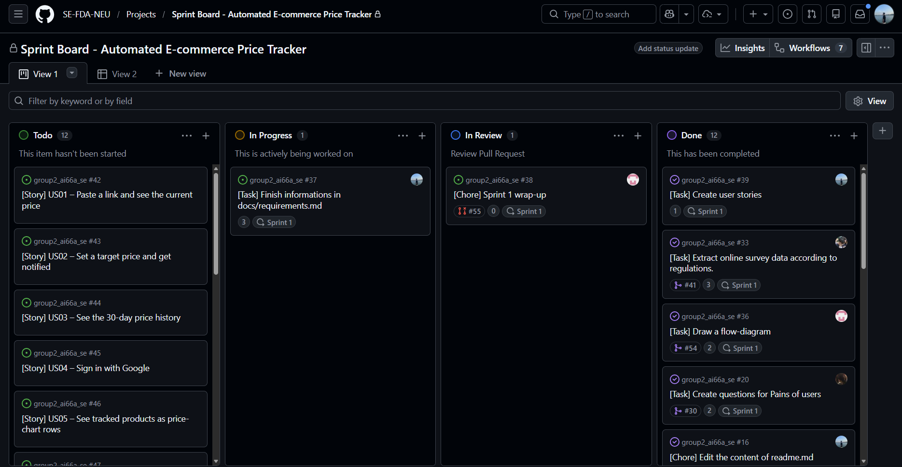

# Milestone 1 - Requirements Document

```
Team:           Team 02 - Automated E-commerce Price Tracker  
Topic:          <your assigned topic>  
Members:        Nguyen Trong Dai (11247268), Mai Huy Dang (11247269)
                Pham Huu Gia An (11247254), Mai Tuan Manh (11247318),
                Le Ba Phong (11247339)
Product Owner:  @Dai-nguyen1506
Scrum Master:   @CaMapCon26   (Sprint 1)  

Repository:     https://github.com/SE-FDA-NEU/group2_ai66a_se.git;  
Project board:  https://github.com/orgs/SE-FDA-NEU/projects/19/views/1;  
Pull Request:   https://github.com/<org>/<repo>/pull/7  
Merge commit:   a1b2c3d

Submitted by:   Nguyen Trong Dai
```

## Proof board




---

## 1. Product vision
<!-- Yêu cầu: Viết đúng 1 CÂU DUY NHẤT. -->
<!-- Nội dung bắt buộc: Dành cho ai, giải quyết vấn đề gì, tại sao không dùng giải pháp thay thế hiển nhiên. -->
[Điền Product Vision của nhóm vào đây]

## 2. Personas
<!-- Yêu cầu: Ít nhất 2 personas (3 personas nếu nhóm 5 người). Phải được xây dựng từ các cuộc trò chuyện/khảo sát thực tế. -->

### Persona 1: [Tên Persona - VD: Ngọc, sinh viên năm 2...]
- **Role (Vai trò):** [VD: Khách hàng, sinh viên, quản trị viên...]
- **Goal (Mục tiêu):** [Họ muốn đạt được điều gì thông qua hệ thống?]
- **Blocked by (Khó khăn/Rào cản):** [Điều gì đang cản trở họ đạt được mục tiêu lúc này?]
- **In their words (Trích dẫn):** "[Trích dẫn ĐÚNG 1 CÂU NÓI nguyên văn từ kết quả khảo sát/phỏng vấn]"
- **Interview note (Ghi chú phỏng vấn):** [Bạn đã phỏng vấn ai, vào thời gian nào. VD: Phỏng vấn bạn A qua Google Form ngày 15/09 hoặc phỏng vấn trực tiếp tại trường...]

### Persona 2: [Tên Persona 2]
- **Role:** [...]
- **Goal:** [...]
- **Blocked by:** [...]
- **In their words:** "[...]"
- **Interview note:** [...]

## 3. Scenarios
<!-- Yêu cầu: Ít nhất 2 kịch bản (mỗi Persona 1 kịch bản). -->
<!-- Độ dài: 6-10 bước được đánh số. Viết bằng ngôn ngữ tự nhiên, KHÔNG dùng tên màn hình hay tên nút bấm. -->

### Scenario 1: [Tên kịch bản cho Persona 1 - VD: Ngọc đặt bàn thành công]
1. [Bước 1...]
2. [Bước 2...]
3. [Bước 3...]
4. [Bước 4...]
5. [Bước 5...]
6. [Bước 6...]

### Scenario 2: [Tên kịch bản cho Persona 2]
1. [...]
2. [...]
...

## 4. User stories
<!-- Yêu cầu: Ít nhất 10 stories (12 stories nếu nhóm 5 người), trong đó 4-6 stories thuộc về PO. -->

| ID | Story | Priority | Points |
|---|---|---|---|
| US01 | As a [persona], I want to [action] so that [benefit] | PO | [Số point] |
| US02 | As a [persona], I want to [action] so that [benefit] | P2 | [Số point] |
<!-- Thêm đủ các dòng cho các User Story còn lại -->

**Acceptance criteria (Tiêu chí nghiệm thu & Tasks)**
<!-- Yêu cầu: Mỗi story có ÍT NHẤT 2 tiêu chí Acceptance criteria theo cấu trúc Given-When-Then. TRONG ĐÓ, ít nhất 1 tiêu chí phải chứa một CON SỐ CỤ THỂ hoặc GIÁ TRỊ KỲ VỌNG CHÍNH XÁC. -->

**US01 [Tên ngắn gọn của US01] - Màn hình: /[tên-màn-hình]**
*Acceptance criteria:*
- Given [Bối cảnh], when [Hành động], then [Kết quả với con số cụ thể, vd: hiện ra trong 2 giây / hiển thị chính xác giá 24,000].
- Given [Bối cảnh 2], when [Hành động 2], then [Kết quả 2].
*Tasks:*
- [Task 1] - @[tên-thành-viên]
- [Task 2] - @[tên-thành-viên]

**US02 [Tên ngắn gọn của US02] - Màn hình: /[tên-màn-hình]**
*Acceptance criteria:*
- Given [...], when [...], then [...]
- Given [...], when [...], then [...]
*Tasks:*
- [...]

## 5. Business rules
<!-- Yêu cầu: Ít nhất 6 quy tắc (Rules). Đây là các ràng buộc hệ thống ép buộc, không phải là tính năng. Mỗi quy tắc phải có 1 ví dụ minh họa bằng số liệu thực tế. -->

| ID | Rule (Quy tắc) | Worked example (Ví dụ minh họa thực tế) |
|---|---|---|
| BR1 | [Nội dung quy tắc 1] | [Ví dụ minh họa sử dụng con số. VD: Cố gắng đặt 2 khung giờ trùng nhau -> bị từ chối] |
| BR2 | [Nội dung quy tắc 2] | [...] |
| BR3 | [...] | [...] |
| BR4 | [...] | [...] |
| BR5 | [...] | [...] |
| BR6 | [...] | [...] |

## 6. Screens and flow
<!-- Yêu cầu: Ít nhất 5 màn hình. Bảng định tuyến và 1 sơ đồ luồng (Flow diagram). Mọi màn hình phải xuất hiện trong sơ đồ và có thể truy cập được. -->

| Route | Purpose (Mục đích) | Access (G, U, A) | Priority |
|---|---|---|---|
| / | [Trang chủ / Đăng nhập...] | G | PO |
| /[route-2] | [...] | U | PO |
| /[route-3] | [...] | A | P2 |
| /[route-4] | [...] | [...] | [...] |
| /[route-5] | [...] | [...] | [...] |

**Flow diagram:**

<!-- Lưu ý: Vẽ sơ đồ luồng các màn hình ở trên (có thể vẽ tay chụp ảnh hoặc dùng tool). Lưu hình ảnh với tên tương ứng vào thư mục docs/images/ trong repository của nhóm. -->